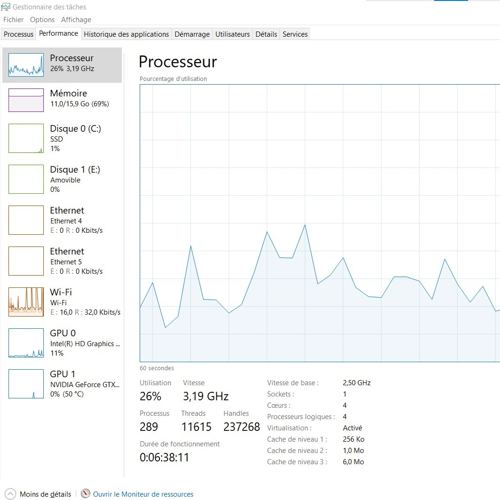

# Guide d'installation

## Depuis une machine Windows

Prérequis: Depuis le gestionnaire de tâche de Windows et les performances, il faut vérifier que la virtualisation est activée sinon [suivez ce tutoriel](https://support.microsoft.com/fr-fr/windows/activer-la-virtualisation-sur-windows-c5578302-6e43-4b4b-a449-8ced115f58e1) pour l'activer depuis le BIOS

1. [Installez VirtualBox selon votre OS](https://www.virtualbox.org/wiki/Downloads)
- Laissez les paramètres par défaut et acceptez les conditions
2. Installez les images ISO suivants depuis les liens ci-dessous
- [Debian 13](https://www.debian.org/download)
- [Fedora Server Netinstall](https://download.fedoraproject.org/pub/fedora/linux/releases/44/Server/x86_64/iso/Fedora-Server-netinst-x86_64-44-1.7.iso)

---

## Depuis une machine MacOS

1. [Créez un compte sur Broadcom](https://profile.broadcom.com/web/registration)
2. [Installez VMWare Fusion](https://support.broadcom.com/group/ecx/productdownloads?subfamily=VMware+Fusion)
3. [Téléchargez l'image ISO Ubuntu 24.04](https://cdimage.ubuntu.com/releases/24.04/release/ubuntu-24.04.1-live-server-arm64.iso)
4. [Téléchargez l'image ISO Debian 12.11.0 Bookworm](https://sourceforge.net/projects/osboxes/files/v/vm/14-D-bn/12.11.0/64bit.7z/download)
5. [Téléchargez l'image ISO Fedora 42 Server](https://sourceforge.net/projects/osboxes/files/v/vm/18-F-d-a/42/Server/64bit.7z/download)
6. Lancez VMWare Fusion et cliquez sur +
7. Depuis les fichiers sources ISO dans vos dossiers, faites drag and drop (glisser déposer) de vos images sur l'interface de VMWare Fusion pour créer une VM
8. Répétez les étapes 6 et 7 pour chaque image ISO